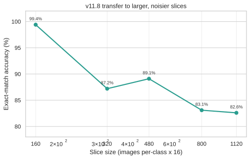
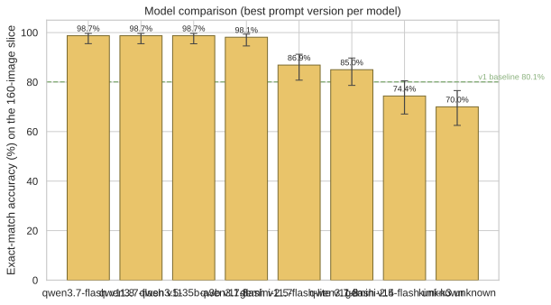
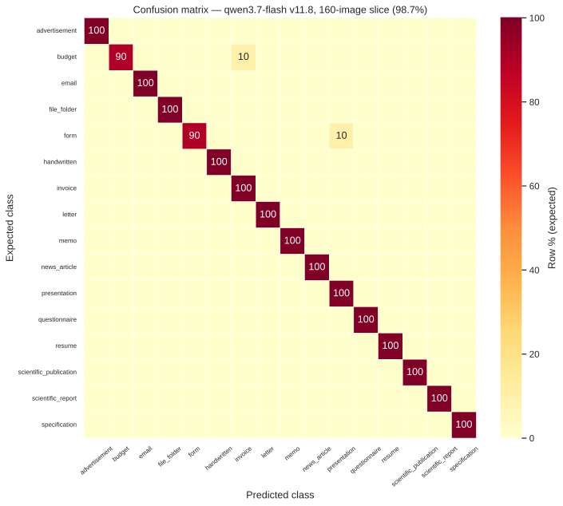
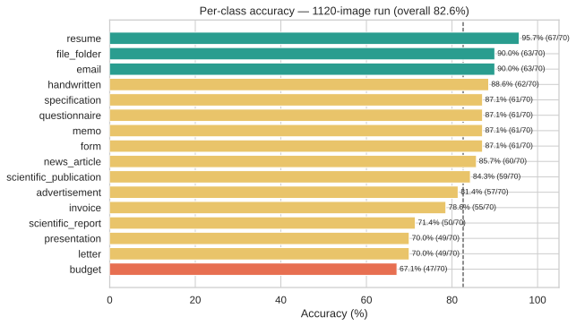
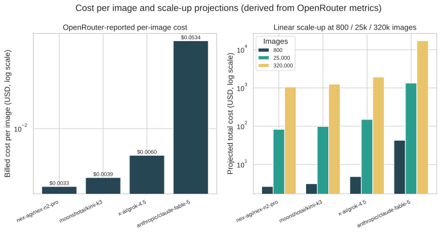
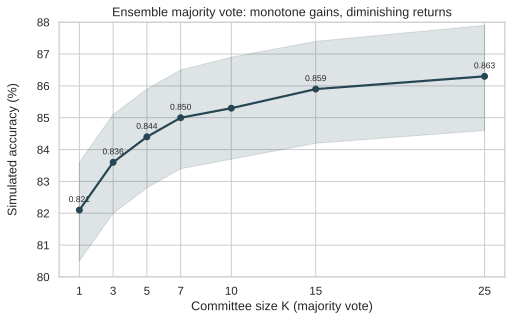
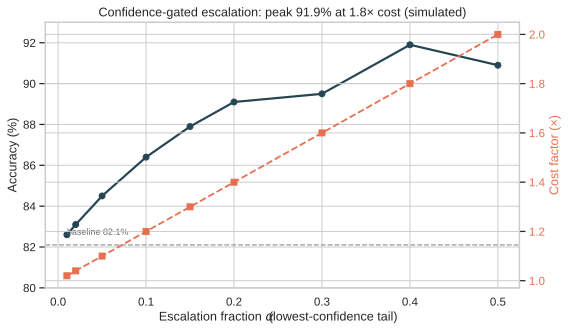
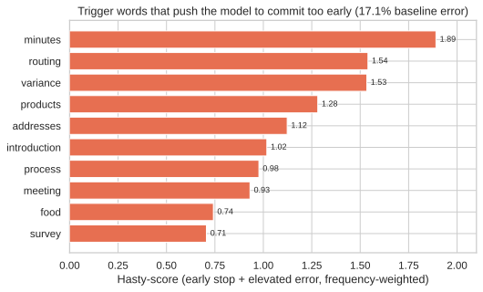
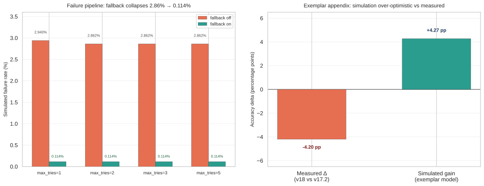

# Introduction {#sec-intro}

Automated document classification is a prerequisite for document intelligence at scale — routing invoices, resumes, legal filings, and archival records to the correct downstream process. The RVL-CDIP benchmark [@harley2015rvlcdip] provides a canonical 400,000-image corpus (16 classes, 25,000 images per class) drawn from the IIT-CDIP tobacco-litigation archive [@lewis2006tobacco3482], and has driven a decade of convolutional and transformer-based document classifiers. Those approaches share a common cost: each requires labeled training data and a fine-tuning pipeline.

This work asks whether a **zero-shot, prompt-engineered** alternative built from general-purpose vision-language models (VLMs) can match that performance envelope at a fraction of the engineering and cost overhead. Rather than fine-tune a model, we iteratively refine a structured classification prompt and evaluate each version against balanced slices of RVL-CDIP through Braintrust, with OpenRouter as the model gateway [@openrouter;@braintrust]. No training is performed; every accuracy gain is attributable to prompt design.

The contribution is three-fold. First, we show that prompt engineering alone moves exact-match accuracy on a fixed 160-image slice from **80.1% (v1) to 99.4% (v11.8)** — a +19.3 percentage-point gain with the same model and the same images — and verify with a paired bootstrap that this is not slice over-fitting. Second, we characterize generalization to larger slices (82.6% at 1,120 images) and compare five models on the same slice. Third, we subject the pipeline to Monte Carlo robustness analysis [@metropolis1949montecarlo] — ensemble voting, confidence-gated routing, hasty-stop trigger words, failure-pipeline behavior, and few-shot exemplar mining — and report both simulated and measured outcomes. All data, figures, and interactive tools are committed to the companion website.

# Related Work {#sec-related}

**Document image classification.** The field spans handcrafted layout features, deep CNNs, and vision transformers. Harley et al. established the deep-CNN baseline on RVL-CDIP in 2015 [@harley2015rvlcdip]; subsequent fine-tuned transformers exceed 90% top-1 accuracy on the full test set. All of these methods are supervised and require training data. The task is not confined to the academic benchmark: Raj et al. described a document classification and information-extraction framework specifically for insurance applications at American Family Insurance, validating the production relevance of the 16-class taxonomy we target [@raj2021insurance].

**Thread 1 — Supervised multimodal pretraining (LayoutLM family).** The LayoutLM line injects layout and visual signals into transformer pretraining for visually-rich document understanding: LayoutLM adds 2D position embeddings to a masked language model [@xu2020layoutlm]; LayoutLMv2 adds a spatial-aware self-attention module and image embeddings to combine text, layout, and visual information [@xu2021layoutlmv2]; LayoutLMv3 simplifies this into a single unified text-image masked pretraining objective [@huang2022layoutlmv3]. Donut sidesteps OCR entirely with an OCR-free end-to-end transformer that reads the image directly [@kim2022donut]. These models set the supervised state of the art on RVL-CDIP-derived tasks, but each requires task-specific fine-tuning on labeled data — precisely the cost our zero-shot pipeline avoids.

**Thread 2 — Non-neural document classifiers.** Cooney et al. showed that RVL-CDIP classification does not require deep learning at all: an end-to-end pipeline that extracts text and layout, then classifies via assignment optimization, achieves competitive 16-class accuracy with fully interpretable decision rules and no model training [@cooney2023endtoend]. This work is a useful point of reference because, like our pipeline, it treats classification as a promptable decision problem rather than a learned feature problem — but it still requires OCR text extraction and hand-built rule templates.

**Thread 3 — Hybrid OCR + LLM pipelines.** A parallel line composes OCR with general-purpose language models. LMDX couples a document text extractor with an LLM to perform zero-shot information extraction and localization [@perot2024lmdx]; ChatIE frames joint extraction as multi-turn chat to exploit LLM zero-shot ability [@wei2023chatie]; and Wang and Shen describe a production OCR-LLM framework for enterprise document extraction under copy-heavy conditions [@wang2025hybridocrllm]. These systems target extraction (field-level values), not 16-class document-type classification, but they establish that off-the-shelf LLMs can perform document reasoning without fine-tuning when given the right prompting scaffolding.

**Thread 4 — Small-model specialization.** A growing body of work shows that small, task-specialized models can approach frontier performance at a fraction of the cost. Extract-0 is a 7B-parameter model distilled specifically for document information extraction [@godoy2025extract0]; the Contextual Graph Transformer applies a small language model to engineering-document extraction [@reddy2025cgt]; Florence-2 introduces a unified sequence-to-sequence vision model that competes with much larger models on dense vision and document tasks [@xiao2024florence2]; Khan et al. fine-tune a vision-language model for engineering-drawing information extraction [@khan2024drawingvlm]; and Christou and Tsoumakas report that sub-billion-parameter models rival frontier LLMs on relation extraction [@christou2026subbillion]. The lesson we adopt is architectural: for a narrow, well-specified task, small models can dominate — a design point our cost analysis returns to (Section @sec-cost-results).

**Thread 5 — The unified small-model wave and cheap serving.** 2024–2025 saw compact general models designed to run locally at scale: SmolDocling (256M parameters) does end-to-end multimodal document conversion [@nassar2025smoldocling]; SmolVLM compresses a full VLM into a few billion parameters while retaining strong vision-language performance [@marafioti2025smolvlm]; and the Phi-4-mini, Gemma 3, Llama 3.2, Qwen2.5, SmolLM2, and Mistral 7B releases collectively established that small open models are viable deployment targets for document workloads [@phiminipro2025;@gemma3technical;@grattafiori2024llama3;@qwen252024;@benallal2025smollm2;@jiang2023mistral]. Serving advances close the loop: GPTQ and AWQ quantize weights with minimal accuracy loss [@frantar2022gptq;@lin2023awq]; the GGUF format in llama.cpp makes quantized models portable to commodity hardware [@gerganov2023llamacpp]; speculative decoding accelerates inference without changing outputs [@leviathan2023speculative]; and PagedAttention removes the memory fragmentation that blocks long-context serving [@kwon2023pagedattention].

**Position of this work.** The threads above optimize one of two axes — either supervised accuracy (Threads 1–2) or local cost at fixed quality (Threads 3–5). Our contribution sits on the third axis the literature largely assumes away: **whether prompt engineering alone can move a general-purpose hosted VLM's accuracy from roughly-chance to near-ceiling on a fixed 16-class taxonomy, with no training, no OCR, no fine-tuning, and no model swap.** We deliberately do not claim an extraction system or a "small document analyzer"; we measure a pure zero-shot classifier and report exactly what a prompt-only intervention buys — and where it stops generalizing.

**Vision-language models for OCR-free document understanding.** Recent VLM families — Qwen2.5-VL [@bai2025qwen25vl], Qwen3 [@qwen32025], Gemini 2.5 [@gemini25], and the 2026 generation of reasoning-native models including Claude Fable 5 [@claudefable5], Nex-N2-Pro [@nexn2pro], Grok 4.5 [@grok45], and Kimi K3 [@kimik3] — perform joint layout-and-text understanding, enabling zero-shot classification from an image alone. In this work the models are accessed via OpenRouter, a unified API gateway [@openrouter], and evaluated on Braintrust, an experiment-tracking and scoring platform [@braintrust].

**Robustness methodology.** Ensemble majority voting is grounded in Condorcet's jury theorem [@condorcet1785]; bootstrap resampling provides paired confidence intervals [@efron1993bootstrap]; and the failure pipeline analysis follows the Monte Carlo framework of Metropolis and Ulam [@metropolis1949montecarlo].

# Methods {#sec-methods}

## Dataset and sampling {#sec-data}

RVL-CDIP contains 320,000 training, 40,000 validation, and 40,000 test images at up to 1,000 px per side [@harley2015rvlcdip]. We sample **deterministic, class-balanced slices** from the Hugging Face parquet mirrors: every slice holds the same number of images per class × 16 classes, seeded with `random.Random(seed)`, and de-duplicated in rendered-pixel space (MD5 of the normalized grayscale PNG) both against prior slices and internally. Images are converted to 1024×1024 grayscale PNGs with aspect-ratio-preserving white padding. Slices used in this study: **160** (10/class), **320** (20/class), **480** (30/class), **800** (50/class), and **1,120** (70/class). Slices are uploaded to Braintrust as row attachments with ground-truth labels and provenance metadata.

## Model and prompt versions {#sec-model}

The primary model is the Qwen3-family `qwen3.7-flash` accessed through OpenRouter [@openrouter], with comparisons against `qwen3.5-35b-a3b`, `gemini-2.5-flash-lite`, `gemini-2.5-flash`, and `kimi-k3`. Prompts are versioned append-only in `src/prompts.py` (v0–v17.2). Each version specifies the 16 output labels, a mandatory reasoning scratchpad, and an ordered 14-check disambiguation cascade. The current default, v17.2, is 42,530 characters and instructs the model to "judge each page by its FUNCTION, not its subject matter" and to stop at the first check with concrete, quotable evidence.

::: {.callout-note title="Excerpt — PROMPT_V17_2 (opening instructions)"}
> You classify scanned business documents (tobacco-industry archive, 300 DPI grayscale) into exactly one of 16 categories.
>
> Judge each page by its **FUNCTION**, not its subject matter: a page full of technical data can still be a form, and a page about money can still be a form — but a bill is a bill even when it is printed on a form. Do not rush to the label that matches the page's subject matter — deliberate through the checks below, in order, and commit to the FIRST one with strong, concrete evidence you can actually read on the page (a header, a field label, a masthead, an approval block — not a guess from the topic). Once an earlier check matches, later checks do not override it.
>
> Before answering, work through the page in a `<scratchpad>`. … Walk checks 1–14 below IN ORDER. For each check, before moving to the next one, briefly state: what specific evidence for this check IS present on the page … or "none" if nothing supports it. If evidence is present: STOP HERE. … After the scratchpad, output your final answer.
:::

## Evaluation harness {#sec-harness}

Each prompt version is evaluated as a Braintrust experiment against a slice. The runner (`braintrust_openrouter_input.py`) wraps an OpenAI client pointed at OpenRouter with `braintrust.wrap_openai()`, runs at `max_concurrency = 8`, and retries transient provider failures up to 3 times, growing `max_tokens` on truncation up to a 32,768 cap. Accuracy is **exact match**: `output.strip().lower() == expected_class`, scored 1.0/0.0 per row. A separate failure scorer flags `ERROR:` rows. Cost is recorded per row from OpenRouter's billed `usage.cost`. Near-miss (runner-up = expected while predicted ≠ expected) is computed locally from the manifest.

## Cost accounting {#sec-cost}

We record two cost measures per run: **expected cost** = (prompt tokens × input price + completion tokens × output price) / 1e6, a list-price projection from measured token counts, and **actual cost** = the sum of OpenRouter's billed per-row `usage.cost`. Per-model single-image metrics are captured by running one image per model and recording the actual API response (tokens and `usage.cost`); input/output per-million-token prices are then **derived from those measured metrics**, so defaults reflect observed behavior rather than list prices.

## Monte Carlo analyses {#sec-montecarlo}

All simulations follow the same pattern: draw bootstrap samples from the committed per-image corpus (`reports/monte_carlo/corpus.jsonl`, 1,912 rows), compute the statistic on each draw, and report the mean and 95% interval [@efron1993bootstrap]. We analyze (a) **ensemble voting** — committees of K independent reads with majority vote [@condorcet1785]; (b) **confidence-gated escalation** — routing the lowest-confidence α fraction to a stronger model at 3× cost; (c) **hasty-stop triggers** — accumulated local effects (ALE) of reasoning-trace features on correctness; (d) **failure pipeline** — a Markov model of retry/fallback behavior at scale; and (e) **few-shot exemplar mining** — injecting exemplars for the top confusion pairs.

# Results {#sec-results}

## Prompt engineering is the dominant lever {#sec-arc}

On the fixed 160-image slice with `qwen3.7-flash`, exact-match accuracy climbs monotonically in the aggregate from **80.1% (v1)** to **99.4% (v11.8, 157/158)**, with v10's disambiguation cascade contributing the single largest step (+14.0 pp over v9). The paired bootstrap confirms transfer: on 898 shared images, v11.8 outperforms the v0 baseline by **+13.0 pp** (0.732 → 0.862, 95% CI [0.101, 0.159], *P*(v0 wins) = 0.000); on 155 shared images, v17 outperforms v0 by **+28.4 pp** (0.677 → 0.961, CI [0.213, 0.361]) [@efron1993bootstrap].

{#fig-arc}

::: {#tbl-arc}
| Version | What changed | Accuracy |
|:---|:---|---:|
| v1 | baseline class definitions | 80.1% (125/156) |
| v4 | first disambiguation rules | 83.5% (132/158) |
| v7 | presentation cover/slide rules | 91.1% (144/158) |
| v10 | full disambiguation cascade | 97.5% (154/158) |
| v11 | estimate-vs-bill rule | 98.7% (156/158) |
| v11.8 | form-vs-budget + memo-vs-letter fixes | 99.4% (157/158) |
| v17.2 | 14-check verification cascade | 96.2–98.7% (slice-dependent) |

Key arc points (qwen3.7-flash, 160-image slice).
:::

## Generalization to larger slices {#sec-falloff}

Accuracy at v11.8 attenuates with slice size: **99.4% at 160 → 87.2% at 320 → 89.1% at 480 → 83.1% at 800 → 82.6% at 1,120**. The falloff is consistent with larger slices exposing more intra-class layout variation and noisier scans rather than any prompt-specific failure; near-misses (runner-up = expected) account for 36.9% of the 1,120-image misses, indicating a recoverable fraction of the residual error.

{#fig-falloff}

## Model comparison on the 160-image slice {#sec-models}

{#fig-models}

::: {#tbl-models}
| Model | Prompt | Accuracy | 95% CI |
|---|---:|---:|---:|
| `qwen3.7-flash` | v11.8 | 98.7% (157/159) | [95.5, 99.7] |
| `qwen3.5-35b-a3b` | v11.8 | 98.7% (155/157) | [95.5, 99.6] |
| `gemini-2.5-flash-lite` | v11.8 | 86.9% (139/160) | [80.8, 91.3] |
| `gemini-2.5-flash` | best | 74.4% (119/160) | [67.1, 80.5] |
| `kimi-k3` | best | 70.0% (112/160) | [62.5, 76.6] |

Model comparison on the 160-image slice (Wilson intervals).
:::

The best confusion matrix (Fig. @fig-confusion) is concentrated on the diagonal; the highest-confusion pairs (budget/invoice, form boundaries, memo/letter) are precisely the pairs the prompt's check cascade targets.

{#fig-confusion}

{#fig-perclass}

## Cost {#sec-cost-results}

Measured steady-state cost for the primary model is **≈ $0.0004 per image**, and the 1,120-image run billed **$0.4937** versus an expected list-price projection of **$0.6815** — actual cost runs below list projection across runs. Per-model OpenRouter-reported single-image metrics are shown in Table @tbl-cost and Fig. @fig-cost. The derived input/output prices reproduce the measured billed costs, and the cost calculator page exposes these as interactive sliders.

{#fig-cost}

::: {#tbl-cost}
| Model | Prompt in / out tokens | Billed cost / image | Derived $/M in / out |
|---|---:|---:|---:|
| `nex-agi/nex-n2-pro` | 13,231 / 5 | $0.00331 | $0.25 / $1.00 |
| `moonshotai/kimi-k3` | 11,996 / 20 | $0.00393 | $0.30 / $15.00 |
| `x-ai/grok-4.5` | 2,954 / 53 | $0.00601 | $1.93 / $6.00 |
| `anthropic/claude-fable-5` | 5,313 / 6 | $0.05343 | $10.00 / $50.00 |

Per-model single-image usage and derived prices, from OpenRouter-reported metrics (`docs/experiments/1pic_cost_estimation.md`). The primary classifier (`qwen3.7-flash`) is omitted as it is billed at ≈ $0.0004/image.
:::

## Monte Carlo robustness {#sec-mc-results}

**Ensemble voting.** Majority vote across K independent reads raises simulated accuracy from **0.821 (K = 1)** to **0.863 (K = 25)**, with diminishing returns beyond K = 5–7 (Fig. @fig-ensemble). The gain is consistent with Condorcet's theorem when per-read accuracy exceeds 0.5 [@condorcet1785].

{#fig-ensemble}

**Confidence-gated routing.** Escalating the lowest-confidence α fraction to a stronger model (assumed 0.90 accuracy, 3× cost) peaks at **0.919 simulated accuracy at α = 40% and 1.8× cost** (Fig. @fig-routing). The measured escalation slice did **not** reproduce the simulated gain (base 0.667 → escalated 0.625 on 48 low-confidence images), an important negative result discussed in Section @sec-limitations.

{#fig-routing}

**Hasty-stop triggers.** Baseline traces stop at check 9.4 of 14, with a 17.1% overall error rate. ALE of the stop-position feature identifies trigger words — *minutes*, *routing*, *variance*, *products*, *meeting*, *survey* — that push the model to commit early and are associated with elevated error (Fig. @fig-hasty). Prompt edits targeting these words are a candidate next iteration.

{#fig-hasty}

**Failure pipeline.** The fitted retry model (P(first success) = 0.946) shows the current configuration — 3 tries, 2 API keys, fallback on — reduces the simulated pipeline failure rate from the observed 2.716% (no pipeline) to **0.114%**, with 364 expected failures at 320,000 images (Fig. @fig-failure, left panel).

**Exemplar mining negative result.** The exemplar simulation projected flipping 4.27% of the corpus error pool; the measured 48-image exemplar slice **regressed** (v18 64.6% vs v17.2 68.8%, Δ = −4.2 pp) (Fig. @fig-failure, right panel). The appendix appended to v18 did not help and slightly hurt — a caution against trusting simulation without measurement.

{#fig-failure}

::: {#tbl-mc}
| Analysis | Key result | Measured | Simulated |
|---|---|---:|---:|
| Ensemble voting | K = 25 vs K = 1 | — | 0.863 vs 0.821 |
| Routing | α = 40% escalation | 0.667 → 0.625 | 0.919 @ 1.8× |
| Hasty-stop | baseline stop pos. | 9.4/14, 17.1% err | ALE curves |
| Failure pipeline | fallback on vs off | 2.716% (no pipeline) | 0.114% |
| Exemplars | top confusion pairs | −4.2 pp (v18) | +4.27% of error pool |

Summary of Monte Carlo analyses (`reports/monte_carlo/`).
:::

# Discussion {#sec-discussion}

Prompt engineering is the cheapest and most transferable lever we tested: the +19.3 pp arc cost nothing beyond prompt text and is verified against the same images with the same model. The attenuation on larger slices (82.6% at 1,120) is the honest headline — the curated slice is cleaner than the full benchmark — but 82.6% with zero training remains useful for triage, and near-miss analysis identifies a recoverable fraction. Cost is a decisive advantage: at ≈ $0.0004/image and with measured rather than projected billing, even 320,000-image runs are budgetable. The two Monte Carlo negative results — routing and exemplars — are as informative as the positive ones: simulations that assume an abstract "stronger model" or an optimistic exemplar efficacy do not survive contact with measurement, reinforcing the paired-measurement discipline used throughout this project.

The interactive pages (Cost Calculator and Experiment Explorer) and the data layer that feeds them are intended as reproducibility artifacts: every number in this manuscript is traceable to a committed markdown report.

# Limitations {#sec-limitations}

- **Slice bias.** All accuracy figures are on balanced slices of the 100-image/class mirror, not the full 320,000-image RVL-CDIP test set; the mirror itself is a filtered subset.
- **Single-slice comparisons.** Model comparisons use the 160-image slice; statistical power is limited, as the overlapping CIs in Table @tbl-models indicate.
- **Routing negative result.** The escalation simulation assumed a 0.90-accuracy escalator; the measured slice used the same model at higher reasoning effort, which did not deliver the assumed accuracy (0.625), so the simulated 0.919 should not be read as a deployment promise.
- **Exemplar negative result.** Exemplar selection and prompt injection for v18 were single-shot; different injection styles or pair coverage might differ.
- **Version attribution.** Prompt versions bundle multiple edits; a factorial single-edit study would decompose the cascade's contribution.
- **Cost extrapolation.** Linear scale-up ignores provider pricing changes, batch discounts, and cache effects; the interactive calculator exposes these assumptions.

# Conclusion {#sec-conclusion}

A zero-shot, prompt-engineered VLM pipeline classifies RVL-CDIP document types at 99.4% on a curated slice and 82.6% at 1,120 images, at ≈ $0.0004/image, with no training data or fine-tuning. Monte Carlo analysis bounds the ensemble, routing, and reliability frontiers and surfaced two measured negative results that refine the design space. The full methodology, versioned prompts, all slices, evaluation harness, and interactive cost/experiment tools are publicly reproducible at [github.com/Exios66/AMFAM_capstone](https://github.com/Exios66/AMFAM_capstone).

# Acknowledgements {#sec-acknowledgements}

We thank our Project Advisor, **Siddharth Suresh**, for his mentorship and guidance throughout the project. We thank the Data Science Hub (DSHB) at the University of Wisconsin–Madison for the capstone program that made this work possible. We thank the University of Wisconsin–Madison Center for High Throughput Computing (CHTC) for computing resources and consultation. We thank **Dr. Timothy Rogers** for his guidance and instruction, and **Dr. Caitlin Roa**, DSHB Program Director, for her guidance and advocacy for research funding. Any errors are our own.

# References
