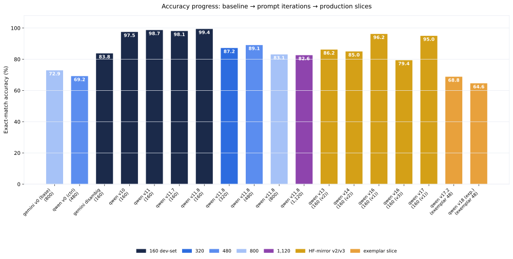

**Research question:** Across 27 versioned prompt iterations (v0 → v17.2), how much of the classification accuracy gain is attributable to prompt engineering rather than model choice or data?

**Formal write-up:** [`prompts/prompt-changelog.qmd`](../prompts/prompt-changelog.html) · [`docs/experiments/experiment_log.md`](https://github.com/Exios66/AMFAM_capstone/blob/main/docs/experiments/experiment_log.md)

---

## Answer, Response, + Summary of Results

Prompt engineering is the dominant lever. On the 160-image `fixed_size_sampled` slice, exact-match accuracy climbs from **80.1%** (v1, `qwen3.7-flash`) to **99.4%** (v11.8, 157/158) — a **+19.3 *pp* gain with the same model and same images**, purely from prompt edits. The improvement is monotonic in the aggregate, with v10's disambiguation cascade (**+14.0 *pp* over v9's 91.1% → v10's 97.5%**) as the single largest step.

**Key arc points (`qwen3.7-flash`, 160-image slice unless noted):**

| Version | What changed | Accuracy |
|:---|:---|---:|
| v1 | baseline class definitions | 80.1% (125/156) |
| v4 | first disambiguation rules | 83.5% (132/158) |
| v7 | presentation cover/slide rules | 91.1% (144/158) |
| v10 | full v9-ruleset disambiguation cascade | **97.5%** (154/158) |
| v11 | estimate-vs-bill rule (v8/v9 wording) | 98.7% (156/158) |
| v11.8 | Fix 1 (form-vs-budget) + Fix 2 (memo-vs-letter) | **99.4%** (157/158) |
| v17.2 | 14-check verification cascade | 96.2%–98.7% (slice-dependent) |

The **paired bootstrap ablation** (`reports/monte_carlo/prompt_ablation.md`) confirms this is not over-fitting to the slice: on 898 shared images, v11.8 beats v0 by **+13.0 *pp*** (0.732 → 0.862, 95% *CI* [−0.159, −0.101], *P*(v0 wins) = 0.000); v17 beats v0 by **+28.4 *pp*** on 155 shared images (0.677 → 0.961, *CI* [−0.361, −0.213]). The v11.8 → v17 comparison is "A likely" (+2.5 *pp*, *CI* [+0.000, +0.057]).

**Conclusion.** Prompt engineering accounts for essentially the entire measured gain from ~80% → ~99% on the curated slice. It is also the **cheapest lever** — no new model spend, only prompt text. The same edits transfer (with attenuation) to noisier slices; see the [generalization memo](generalization-falloff.qmd).

::: {.memo-sources}
*Sources:* `docs/experiments/experiment_log.md` · `reports/monte_carlo/prompt_ablation.md` · `src/prompts.py` · [github.com/Exios66/AMFAM_capstone](https://github.com/Exios66/AMFAM_capstone)
:::

---

## What questions or uncertainties remain?

Whether the v0 → v17.2 gains reflect better rule coverage, better scratchpad self-criticism, or both is not separately identified — every version bundled multiple edits. A true single-edit factorial (one rule changed per run) would decompose the 14-check cascade's contribution. The v11.8 → v17.x comparison on the 160 slice is statistically marginal (*P* = 0.932 "A likely", not decisive), so the current default (v17.2) is not measurably better than v11.8 on that slice.

## What other levers may also improve accuracy?

The near-miss analysis in the [hardest-classes memo](hardest-classes.qmd) shows ~37% of remaining misses are near-misses (runner-up = expected), a ceiling reachable by [few-shot exemplars](exemplar-mining.qmd). Model choice adds a smaller but real increment — see the [model comparison memo](model-comparison.qmd).
