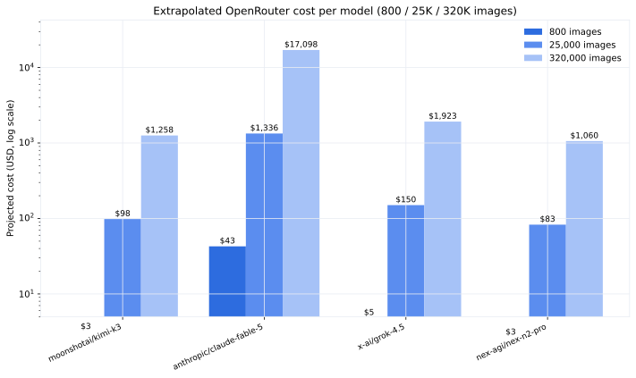

**Research question:** What is the measured per-image cost of 16-class classification, and how does it extrapolate to 800 / 25,000 / 320,000 images across candidate models?

**Formal write-up:** [`cost/cost-estimation.qmd`](../cost/cost-estimation.html) · [`cost/cost-projections.qmd`](../cost/cost-projections.html) · [`docs/experiments/1pic_cost_estimation.md`](https://github.com/Exios66/AMFAM_capstone/blob/main/docs/experiments/1pic_cost_estimation.md)

---

## Answer, Response, + Summary of Results

**Live production runs bill far below list-price projections.** The 1,120-image v11.8 run billed **$0.4937** vs $0.6815 expected (+27.5% discount); the 800-image run billed **$0.34** vs $0.33 expected (+1.1% at 0.03/0.13 pricing), with ~61% of prompt tokens served from cache. **Measured steady-state cost is ≈ $0.0004 per image** for qwen3.7-flash at 1024×1024.

**Extrapolated 320K-image cost (list price × measured single-image tokens):**

| Model | 800 | 25,000 | 320,000 |
|---:|---:|---:|---:|
| nex-agi/nex-n2-pro | $2.65 | $82.82 | $1,060.08 |
| moonshotai/kimi-k3 | $3.14 | $98.28 | $1,257.98 |
| x-ai/grok-4.5 | $4.81 | $150.21 | $1,922.69 |
| anthropic/claude-fable-5 | $42.74 | $1,335.75 | $17,097.60 |

**Image resolution matters more than model price tier in some cases.** Gemini 2.5 Flash at 2550×3300 doubles prompt tokens vs 1024×1024 (3,701 vs 1,637) with *no* accuracy gain (73.75% vs 74.38%) — 1024×1024 is the cost/performance sweet spot. Kimi-k3 at full-res was projected at $1,257.98/320K; resizing to 1024×1024 cuts ~$434 (to ~$824), and 1024×1024 at max_tokens=500 lands at $823.57.

**Conclusion.** At current prices the classification cost is negligible for evaluation-scale runs (≤ $0.5 for 1,120 images) and stays under ~$1,100–1,300 for a 320K production pass with qwen-class pricing. The cheapest high-accuracy path is qwen3.7-flash at 1024×1024.

*Sources:* `docs/experiments/1pic_cost_estimation.md` · `docs/experiments/experiment_log.md` · [github.com/Exios66/AMFAM_capstone](https://github.com/Exios66/AMFAM_capstone)

---

## What questions or uncertainties remain?

Actuals depend on provider pricing, prompt caching hit rate, and reasoning-token volume — all of which drift. The single-image extrapolations assume linear token growth with image count; caching behavior at batch scale could push actuals lower. The next-n2-pro/grok/claude figures are single-image projections, not measured batch runs.

## What other levers may also reduce cost?

The [confidence-routing memo](confidence-routing.qmd) shows escalating only the low-confidence tail keeps cost at 1.02–1.8× while recovering accuracy — cheaper than full-model upgrades. [Ensemble voting](ensemble-voting.qmd) trades +4 pp accuracy for 3–25× cost, useful only where accuracy dominates budget.
