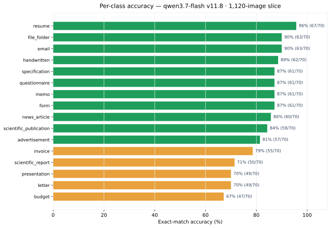

**Research question:** Does the ~99% accuracy achieved on the curated 160-image slice hold when the same prompt is run on larger, independently sampled, noisier evaluation slices?

**Formal write-up:** [`results/headline-results.qmd`](../results/headline-results.html) · [`docs/experiments/experiment_log.md`](https://github.com/Exios66/AMFAM_capstone/blob/main/docs/experiments/experiment_log.md)

---

## Answer, Response, + Summary of Results

**No — accuracy falls monotonically with slice size/noise, but stays well above the pre-prompt-engineering baseline.** With prompt v11.8 (qwen3.7-flash):

| Slice | Images | Accuracy | Drop vs 160 |
|---|---:|---:|---:|
| fixed_size_sampled | 160 | **99.4%** (157/158) | — |
| fixed_size_sampled_480 | 480 | **89.1%** (424/476) | −10.3 pp |
| fixed_size_sampled_320 | 320 | **87.2%** (279/320) | −12.2 pp |
| rvl_cdip_800 | 800 | **83.1%** (665/800) | −16.3 pp |
| 1600_balanced_1120 | 1,120 | **82.6%** (925/1120) | −16.8 pp |

The drop is a slice-content effect, not a prompt failure: the 480-image slice *contains* the 160-image set, so the delta is entirely due to the fresh (harder) 320 images added on top. The 160-image slice is an archived subset curated toward unambiguous exemplars; larger slices draw from the train/test/validation splits of the HF mirror and include the ambiguous agency-estimate, correspondence-header, and form-layout documents that v7+ rules explicitly route.

**Per-class picture on 1,120 images (v11.8):** the classes that hold ~90%+ (`email`, `resume`, `memo`, `file_folder`, `advertisement`) are visually distinctive; the classes that collapse (`budget` ~65%, `presentation` ~69%, `scientific_report` ~73%, `letter` ~74%) are exactly the near-synonym pairs — budget↔invoice, letter↔memo, *→form.

**Conclusion.** The prompt-engineering gain generalizes but is **attenuated by slice noise**: +13.0 pp over v0 on shared 800-run images (0.732 → 0.862) yet −16.8 pp between the curated 160 and the noisy 1,120. Expect ~82–87% on production-like slices, not 99%.

*Sources:* `docs/experiments/experiment_log.md` · `reports/report_qwen3.7-flash_v11.8_reasoning_1600_balanced_1120.md` · [github.com/Exios66/AMFAM_capstone](https://github.com/Exios66/AMFAM_capstone)

---

## What questions or uncertainties remain?

Why the 320 slice (87.2%) scores *lower* than the 480 slice (89.1%) despite being smaller and a strict subset of the 480 is open — seed differences and sampling noise are the leading explanations; a repeat of the 320 slice under a fresh seed would quantify it. The "production-like" ceiling of ~82–87% is estimated from four slices; a dedicated production-noise slice would tighten the estimate.

## What other levers may also recover the generalization gap?

The Monte Carlo robustness studies target exactly this: [ensemble voting](ensemble-voting.qmd) recovers ~+4 pp at 25× cost, [confidence-gated routing](confidence-routing.qmd) recovers ~+5–10 pp on the low-confidence tail, and [few-shot exemplars](exemplar-mining.qmd) attack the near-miss ceiling. See also the [hardest-classes memo](hardest-classes.qmd) for which pairs dominate the larger-slice miss budget.
