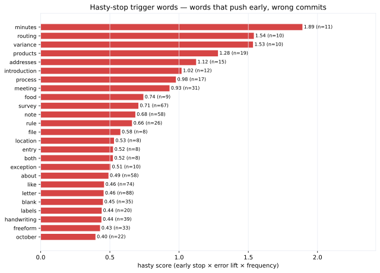

**Research question:** In the 14-check reasoning scratchpad, are there trigger words that push the model to commit to a label prematurely — before the cascade reaches the discriminating checks — and are those premature stops more error-prone?

**Formal write-up:** [`montecarlo/ale-stopword.qmd`](../montecarlo/ale-stopword.html) · [`reports/monte_carlo/ale_stopword_report.md`](https://github.com/Exios66/AMFAM_capstone/blob/main/reports/monte_carlo/ale_stopword_report.md)

---

## Answer, Response, + Summary of Results

**Yes — a small vocabulary of trigger words reliably produces premature, wrong commits.** Across 1,913 reasoning-covered rows (1,832 traces parsed, 1,301 with an explicit stop), the baseline stop position is **check 9.4 of 14** at a **17.1% overall error rate**. Words below are quoted in the stopping evidence of traces that committed early — and are wrong above baseline:

| word | *n* | avg stop # | error rate | early_lift | err_lift | hasty_score |
|---|---:|---:|---:|---:|---:|---:|
| **minutes** | 11 | 2.0 | 82% | 0.88 | +0.65 | **1.891** |
| **routing** | 10 | 3.8 | 90% | 0.67 | +0.73 | **1.540** |
| **variance** | 10 | 4.5 | 100% | 0.59 | +0.83 | **1.534** |
| products | 19 | 4.0 | 63% | 0.64 | +0.46 | 1.281 |
| **meeting** | 31 | 7.0 | 74% | 0.29 | +0.57 | 0.931 |
| **survey** | 67 | 5.8 | 37% | 0.43 | +0.20 | 0.706 |

`hasty_score` = early_lift (how much earlier than baseline the stop happens) × err_lift (how much the error rate rises) weighted by frequency. The worst offenders — **minutes**, **routing**, **variance** — stop at **check 2–5** (before the discriminating financial/correspondence/spec checks) with **82–100% error rates**.

::: {.callout-warning title="The Mechanism"}
These words appear in documents that *look* like one class early (e.g., "meeting minutes" → memo) but belong to another. The model latches onto the trigger word, commits at check ≤7, and never reaches the checks that would disambiguate.
:::

**Conclusion.** Hasty stopping is a measurable, correctable failure mode. The fix is prompt-side: reinforce that the 14-check cascade must run to completion regardless of early-evidence matches, and add explicit "do not commit on the presence of X alone" rules for the top trigger words.

::: {.memo-sources}
*Sources:* `reports/monte_carlo/ale_stopword_report.md` · [github.com/Exios66/AMFAM_capstone](https://github.com/Exios66/AMFAM_capstone)
:::

---

## What questions or uncertainties remain?

The trigger list is corpus-derived (specific to v11.8-era prompts and qwen3.7-flash) — the vocabulary may shift with prompt version or model. Whether a "run all 14 checks" enforcement actually lifts accuracy is untested directly; the ALE analysis shows rising ALE curves for continued checking, which supports but does not prove it.

## What other levers may also improve accuracy?

Premature stops overlap with the near-miss ceiling in the [hardest-classes memo](hardest-classes.qmd) (runner-up = expected). [Few-shot exemplars](exemplar-mining.qmd) teach the full-cascade completion pattern; [verification](../montecarlo/verification.html) tests whether the simulated gains hold when measured.
