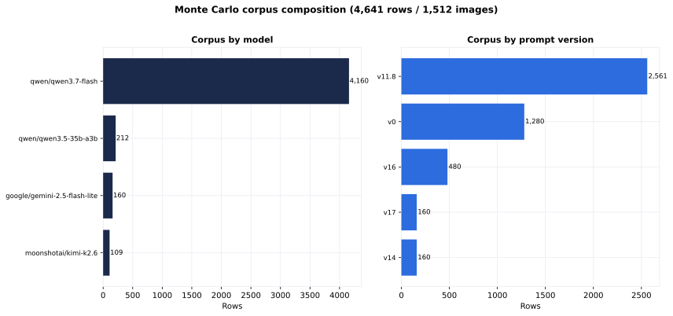

- **Records**: 4,641
- **Images**: 1,512
- **Experiments**: 14
- **Reasoning coverage**: 3,113 / 4,641 rows

## Status

| status | count |
|---|---:|
| completed | 4,520 |
| error | 121 |

## Models

| model | rows |
|---|---:|
| `google/gemini-2.5-flash-lite` | 160 |
| `moonshotai/kimi-k2.6` | 109 |
| `qwen/qwen3.5-35b-a3b` | 212 |
| `qwen/qwen3.7-flash` | 4,160 |

## Prompt versions

| prompt | rows |
|---|---:|
| v0 | 1,280 |
| v11.8 | 2,561 |
| v14 | 160 |
| v16 | 480 |
| v17 | 160 |

## Top confusion pairs

| expected → predicted | count |
|---|---:|
| `email` → `email` | 275 |
| `memo` → `memo` | 267 |
| `advertisement` → `advertisement` | 258 |
| `resume` → `resume` | 255 |
| `scientific_publication` → `scientific_publication` | 254 |
| `file_folder` → `file_folder` | 244 |
| `news_article` → `news_article` | 237 |
| `form` → `form` | 234 |
| `questionnaire` → `questionnaire` | 234 |
| `letter` → `letter` | 231 |
| `specification` → `specification` | 229 |
| `handwritten` → `handwritten` | 221 |
| `invoice` → `invoice` | 213 |
| `scientific_report` → `scientific_report` | 206 |
| `presentation` → `presentation` | 195 |
| `budget` → `budget` | 171 |
| **`letter` → `memo`** | **53** |
| **`budget` → `invoice`** | **52** |
| **`invoice` → `form`** | **41** |
| **`specification` → `form`** | **41** |

::: {.callout-note title="Top Off-Diagonal Confusion Pairs"}
The dominant error pairs are: **`letter`→`memo`** (53), **`budget`→`invoice`** (52),
**`invoice`→`form`** (41), and **`specification`→`form`** (41). The `form` over-attractor
accounts for 5 of the top 8 off-diagonal pairs.
:::
