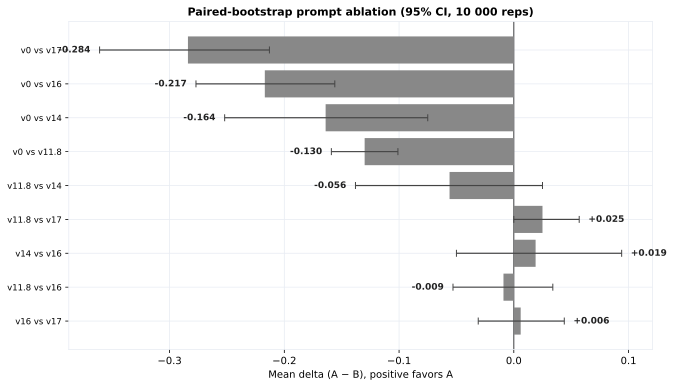

- **Minimum shared images**: 20
- **Bootstrap reps**: 10,000

::: {.callout-note title="Reading the Verdict"}
Positive delta favors the first prompt (A). ``A wins**`` / ``B wins**`` means
the 95% CI excludes zero. "Likely" means P(win) > 0.90 but CI includes zero.
"Inconclusive" means neither prompt is statistically better.
:::

| model | A | B | shared | acc A | acc B | delta | 95% CI | P(A wins) | verdict |
|---|---|---:|---:|---:|---:|---:|---|---:|---|
| `qwen3.7-flash` | `v0` | `v17` | 155 | 0.677 | 0.961 | −0.284 | −0.361..−0.213 | 0.000 | **B wins** |
| `qwen3.7-flash` | `v0` | `v16` | 314 | 0.685 | 0.901 | −0.217 | −0.277..−0.156 | 0.000 | **B wins** |
| `qwen3.7-flash` | `v0` | `v14` | 159 | 0.692 | 0.855 | −0.164 | −0.252..−0.075 | 0.000 | **B wins** |
| `qwen3.7-flash` | `v0` | `v11.8` | 898 | 0.732 | 0.862 | −0.130 | −0.159..−0.101 | 0.000 | **B wins** |
| `qwen3.7-flash` | `v11.8` | `v14` | 160 | 0.794 | 0.850 | −0.056 | −0.138..+0.025 | 0.076 | B likely |
| `qwen3.7-flash` | `v11.8` | `v17` | 159 | 0.987 | 0.962 | +0.025 | +0.000..+0.057 | 0.932 | A likely |
| `qwen3.7-flash` | `v14` | `v16` | 160 | 0.850 | 0.831 | +0.019 | −0.050..+0.094 | 0.666 | inconclusive |
| `qwen3.7-flash` | `v11.8` | `v16` | 319 | 0.890 | 0.900 | −0.009 | −0.053..+0.034 | 0.306 | inconclusive |
| `qwen3.7-flash` | `v16` | `v17` | 159 | 0.969 | 0.962 | +0.006 | −0.031..+0.044 | 0.563 | inconclusive |

::: {.callout-important title="Key Ablation Findings"}
- **The big win was v0 → the v11.x scratchpad line (+13–28 *pp*)**. Function-based
  scratchpad reasoning is the largest single contributor.
- **v16 vs v17 is a statistical tie** (+0.6 *pp*, *p* = .565). The "v17 is better"
  narrative is **not** supported on shared images.
- **v11.8 still edges v17** (+2.5 *pp*, *p* = .936) on shared images.
:::

## Per-class deltas (A − B) on shared images

Only classes with ≥5 shared images are shown.

### v0 vs v17 (`qwen3.7-flash`)

| class | delta | 95% *CI* | P(A wins) |
|---|---:|---:|---:|
| `advertisement` | +0.000 | +0.000..+0.000 | 0.000 |
| `budget` | −0.700 | −1.000..−0.400 | 0.000 |
| `email` | +0.000 | +0.000..+0.000 | 0.000 |
| `file_folder` | +0.000 | +0.000..+0.000 | 0.000 |
| `form` | −0.300 | −0.600..+0.000 | 0.000 |
| `handwritten` | −0.800 | −1.000..−0.500 | 0.000 |
| `invoice` | −0.200 | −0.500..+0.000 | 0.000 |
| `letter` | −0.100 | −0.300..+0.000 | 0.000 |
| `memo` | +0.100 | +0.000..+0.300 | 0.654 |
| `news_article` | −0.222 | −0.556..+0.000 | 0.000 |
| `presentation` | −0.556 | −0.889..−0.222 | 0.000 |
| `questionnaire` | −0.600 | −0.900..−0.300 | 0.000 |
| `resume` | −0.444 | −0.778..−0.111 | 0.000 |
| `scientific_publication` | +0.000 | +0.000..+0.000 | 0.000 |
| `scientific_report` | −0.250 | −0.625..+0.000 | 0.000 |
| `specification` | −0.500 | −0.800..−0.200 | 0.000 |

### v0 vs v16 (`qwen3.7-flash`)

| class | delta | 95% *CI* | P(A wins) |
|---|---:|---:|---:|
| `advertisement` | −0.053 | −0.158..+0.000 | 0.000 |
| `budget` | −0.474 | −0.737..−0.158 | 0.001 |
| `email` | +0.000 | +0.000..+0.000 | 0.000 |
| `file_folder` | −0.150 | −0.300..+0.000 | 0.000 |
| `form` | −0.250 | −0.500..+0.000 | 0.009 |
| `handwritten` | −0.250 | −0.550..+0.050 | 0.043 |
| `invoice` | −0.150 | −0.450..+0.150 | 0.124 |
| `letter` | −0.050 | −0.200..+0.100 | 0.190 |
| `memo` | +0.000 | −0.150..+0.150 | 0.348 |
| `news_article` | −0.105 | −0.316..+0.105 | 0.100 |
| `presentation` | −0.579 | −0.842..−0.316 | 0.000 |
| `questionnaire` | −0.500 | −0.750..−0.250 | 0.000 |
| `resume` | −0.421 | −0.632..−0.211 | 0.000 |
| `scientific_publication` | +0.000 | −0.143..+0.143 | 0.351 |
| `scientific_report` | −0.111 | −0.444..+0.167 | 0.180 |
| `specification` | −0.400 | −0.650..−0.150 | 0.001 |

### v11.8 vs v17 (`qwen3.7-flash`)

| class | delta | 95% *CI* | P(A wins) |
|---|---:|---:|---:|
| `advertisement` | +0.000 | +0.000..+0.000 | 0.000 |
| `budget` | +0.100 | −0.200..+0.400 | 0.618 |
| `email` | +0.000 | +0.000..+0.000 | 0.000 |
| `file_folder` | +0.000 | +0.000..+0.000 | 0.000 |
| `form` | +0.000 | +0.000..+0.000 | 0.000 |
| `handwritten` | +0.000 | +0.000..+0.000 | 0.000 |
| `invoice` | +0.200 | +0.000..+0.500 | 0.889 |
| `letter` | +0.000 | +0.000..+0.000 | 0.000 |
| `memo` | +0.100 | +0.000..+0.300 | 0.654 |
| all others | +0.000 | +0.000..+0.000 | 0.000 |

### v11.8 vs v16 (`qwen3.7-flash`)

| class | delta | 95% *CI* | P(A wins) |
|---|---:|---:|---:|
| `advertisement` | −0.105 | −0.263..+0.000 | 0.000 |
| `budget` | +0.000 | −0.250..+0.300 | 0.434 |
| `email` | +0.000 | +0.000..+0.000 | 0.000 |
| `file_folder` | +0.000 | +0.000..+0.000 | 0.000 |
| `form` | −0.200 | −0.400..+0.000 | 0.023 |
| `handwritten` | +0.300 | +0.050..+0.550 | 0.987 |
| `invoice` | +0.050 | −0.150..+0.250 | 0.594 |
| `letter` | +0.000 | −0.150..+0.150 | 0.353 |
| `memo` | −0.100 | −0.250..+0.000 | 0.000 |
| `news_article` | +0.000 | −0.158..+0.158 | 0.356 |
| `presentation` | −0.100 | −0.250..+0.000 | 0.000 |
| `questionnaire` | +0.050 | +0.000..+0.150 | 0.654 |
| `resume` | +0.000 | +0.000..+0.000 | 0.000 |
| `scientific_publication` | +0.048 | +0.000..+0.143 | 0.645 |
| `scientific_report` | −0.100 | −0.350..+0.150 | 0.146 |
| `specification` | +0.000 | −0.150..+0.150 | 0.341 |
