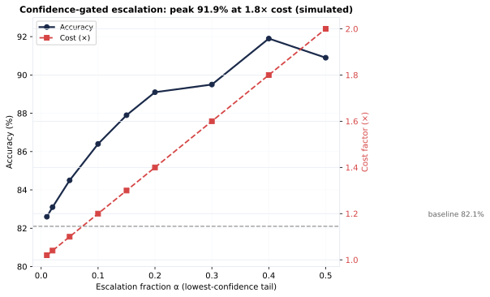

- **Escalated model accuracy**: 90% (assumed)
- **Escalated cost multiplier**: 3.0×

| α (escalate) | escalated | kept | accuracy | 95% *CI* | cost factor |
|---:|---:|---:|---:|---:|---:|
| 1% | 15 | 1,497 | 0.826 | 0.810–0.841 | 1.02× |
| 2% | 30 | 1,482 | 0.831 | 0.816–0.846 | 1.04× |
| 5% | 76 | 1,436 | 0.845 | 0.830–0.859 | 1.10× |
| 10% | 151 | 1,361 | 0.864 | 0.850–0.878 | 1.20× |
| 15% | 227 | 1,285 | 0.879 | 0.865–0.893 | 1.30× |
| 20% | 302 | 1,210 | 0.891 | 0.877–0.904 | 1.40× |
| 30% | 454 | 1,058 | 0.895 | 0.882–0.908 | 1.60× |
| 40% | 605 | 907 | **0.919** | 0.909–0.928 | 1.80× |
| 50% | 756 | 756 | 0.909 | 0.899–0.919 | 2.00× |

::: {.callout-important title="Optimal Escalation Point"}
The accuracy peak is at **α ≈ 40%** (0.919); beyond that, escalating more images adds cost
without accuracy (the tail stops being "low-confidence-wrong"). At **α = 10%**, accuracy
0.864 at just **1.2× cost** — the **best accuracy-per-cost point**.
:::

## Sensitivity to the escalated-model accuracy assumption

| α | accuracy @ acc −5 *pp* | accuracy @ acc | accuracy @ acc +5 *pp* |
|---:|---:|---:|---:|
| 1% | 0.826 | 0.826 | 0.827 |
| 2% | 0.830 | 0.831 | 0.832 |
| 5% | 0.842 | 0.845 | 0.847 |
| 10% | 0.859 | 0.864 | 0.869 |
| 15% | 0.872 | 0.879 | 0.887 |
| 20% | 0.881 | 0.891 | 0.901 |
| 30% | 0.880 | 0.895 | 0.910 |
| 40% | 0.899 | 0.919 | 0.939 |
| 50% | 0.884 | 0.909 | 0.934 |

## Baseline (no escalation)

Observed single-pass accuracy: **0.821** at cost 1.0×.

## How to use

Pick the smallest α whose accuracy meets the target; escalate the filenames in
`escalation_candidates.txt` (top α fraction) through the stronger model and compare
the measured vs simulated accuracy.

::: {.callout-warning title="Measured Negative Result"}
The measured escalation slice **did not reproduce** the simulated gain: base 0.667 →
escalated 0.625 on 48 low-confidence images. The same model at higher reasoning
effort did not help — escalation requires a genuinely stronger model. See
[verification](verification.qmd) for the measured comparison.
:::
