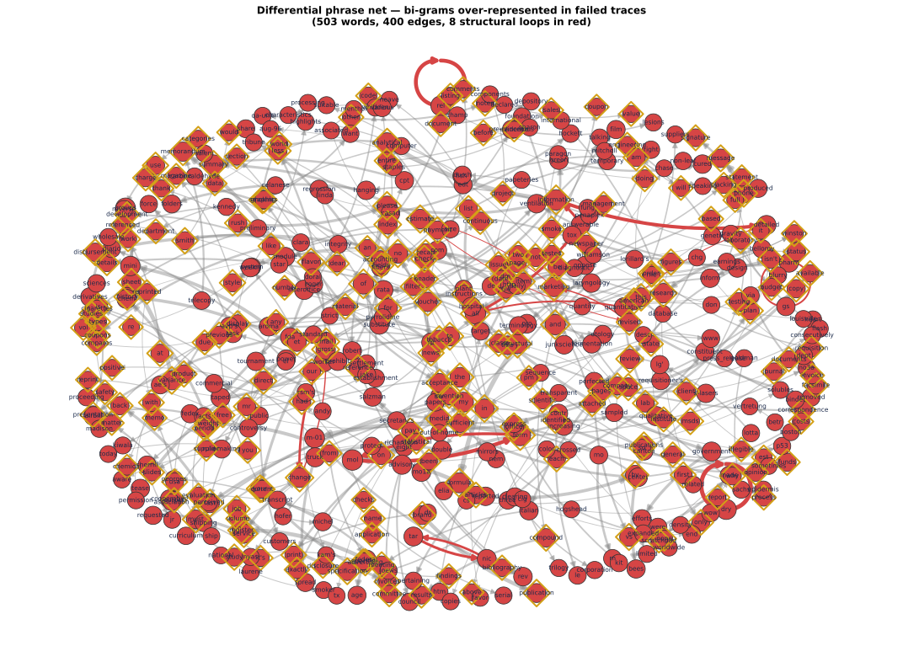
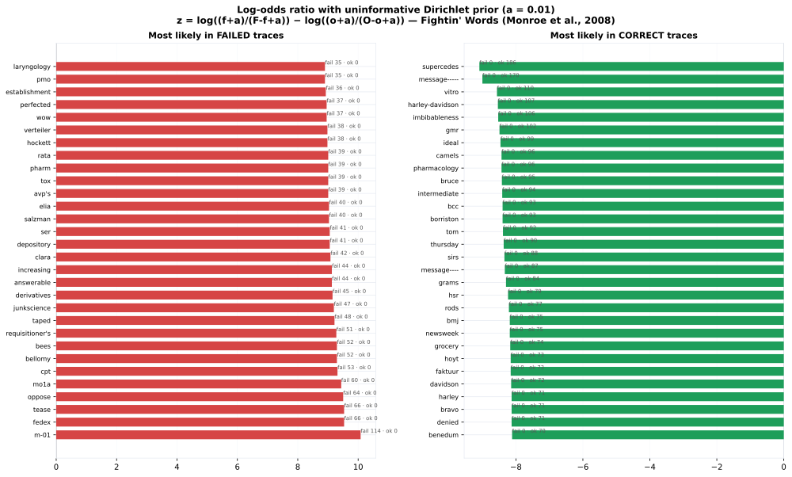
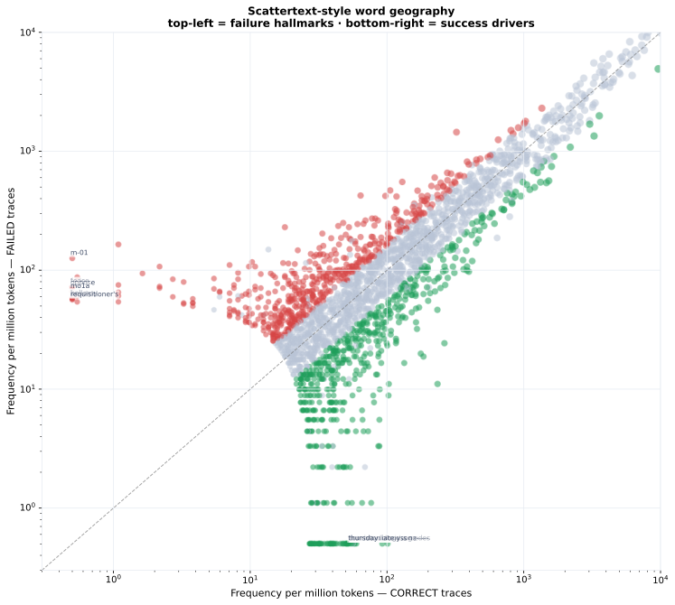

- **Corpus rows (reasoning-covered)**: 3101 (658 failed, 2443 correct)
- **Scope**: all
- **Word tokenization**: content words (stopwords removed); phrase tokenization keeps function words for loop detection
- **Dirichlet prior** a = 0.01 (symmetric pseudo-count)

## Differential Phrase Nets

Directed bi-gram graph of the reasoning traces, restricted to edges whose prevalence in **failed** traces exceeds their prevalence in **correct** traces (log-odds difference ≥ threshold, ≥ min failed occurrences). The differential filter removes the corporate boilerplate and prompt-leaked tokens shared with correct traces, leaving the phrases characteristic of reasoning breakdowns. Diamond-outlined nodes are **prompt-leaked** tokens — words the model parrots from the prompt text itself. Red edges are structural loops.

### Top failure-biased bi-grams

| Bi-gram | Failed *n* | Correct *n* | *z* |
|---|---:|---:|---:|
| `structural → formula` | 115 | 0 | 10.06 |
| `form → m-01` | 111 | 0 | 10.02 |
| `analytical → information` | 108 | 0 | 9.99 |
| `dry → dry` | 102 | 0 | 9.94 |
| `variance → sheet` | 97 | 0 | 9.89 |
| `formula → mol` | 90 | 0 | 9.81 |
| `federal → register` | 88 | 0 | 9.79 |
| `rel → rel` | 84 | 0 | 9.74 |
| `brand → publication` | 81 | 0 | 9.71 |
| `mol → form` | 78 | 0 | 9.67 |
| `interoffice → memorandum` | 75 | 0 | 9.63 |
| `information → detailed` | 67 | 0 | 9.52 |
| `mol → weight` | 67 | 0 | 9.52 |
| `aroma → mini` | 63 | 0 | 9.45 |
| `mini → groups` | 63 | 0 | 9.45 |
| `form → mo1a` | 60 | 0 | 9.41 |
| `reported → by` | 60 | 0 | 9.41 |
| `phone → message` | 60 | 0 | 9.41 |
| `power → tease` | 58 | 0 | 9.37 |
| `job → specification` | 57 | 0 | 9.35 |
| `worker → history` | 57 | 0 | 9.35 |
| `please → substitute` | 54 | 0 | 9.30 |
| `check → disbursement` | 54 | 0 | 9.30 |
| `publications → bees` | 51 | 0 | 9.24 |
| `form → mol` | 51 | 0 | 9.24 |

**124 of 400 differential edges are prompt-leaked** (both words appear in the prompt text) — the model failing while reciting its own instructions.

### Structural loops

8 cycles detected (length ≤ 6). Full inventory with example traces: [phrase_net_loops.md](https://github.com/Exios66/AMFAM_capstone/blob/main/reports/trace_language/phrase_net_loops.md).

| Cycle | Length |
|---|---:|
| `dry` | 1 |
| `gs` | 1 |
| `rel` | 1 |
| `change → gross` | 2 |
| `form → mol` | 2 |
| `nic → tar` | 2 |
| `estimate → revised → marketing` | 3 |
| `all → answerable → information → detailed → quantitative` | 5 |

### Stuck phrases per trace

Back-to-back phrase repetition (`A B A B` or `A B C A B C`):

| Group | Traces | Looping traces | Rate |
|---|---:|---:|---:|
| Failed | 658 | 335 | 50.9% |
| Correct | 2443 | 631 | 25.8% |

## Log-Odds Ratio (Uninformative Dirichlet Prior)

Fightin' Words (Monroe, Colaresi & Quinn, 2008): `z = log((y_f + a)/(n_f - y_f + a)) - log((y_o + a)/(n_o - y_o + a))` with the symmetric prior a on every count. Positive *z* = word is more likely to appear in a failed trace; negative *z* = more likely in a correct trace. Words shared across both classes (boilerplate, prompt-leaked labels) sit near *z* = 0 and drop out of the extremes.

### Top 30 words most likely in FAILED traces

| word | failed *n* | correct *n* | *z* |
|---|---:|---:|---:|
| m-01 | 114 | 0 | 10.08 |
| tease | 66 | 0 | 9.53 |
| fedex | 66 | 0 | 9.53 |
| oppose | 64 | 0 | 9.50 |
| mo1a | 60 | 0 | 9.44 |
| cpt | 53 | 0 | 9.32 |
| bellomy | 52 | 0 | 9.30 |
| bees | 52 | 0 | 9.30 |
| requisitioner's | 51 | 0 | 9.28 |
| taped | 48 | 0 | 9.22 |
| junkscience | 47 | 0 | 9.20 |
| derivatives | 45 | 0 | 9.15 |
| increasing | 44 | 0 | 9.13 |
| answerable | 44 | 0 | 9.13 |
| clara | 42 | 0 | 9.08 |
| ser | 41 | 0 | 9.06 |
| depository | 41 | 0 | 9.06 |
| elia | 40 | 0 | 9.03 |
| salzman | 40 | 0 | 9.03 |
| avp's | 39 | 0 | 9.01 |
| tox | 39 | 0 | 9.01 |
| rata | 39 | 0 | 9.01 |
| pharm | 39 | 0 | 9.01 |
| hockett | 38 | 0 | 8.98 |
| verteiler | 38 | 0 | 8.98 |
| perfected | 37 | 0 | 8.96 |
| wow | 37 | 0 | 8.96 |
| establishment | 36 | 0 | 8.93 |
| laryngology | 35 | 0 | 8.90 |
| pmo | 35 | 0 | 8.90 |

### Top 30 words most likely in CORRECT traces

| word | failed *n* | correct *n* | *z* |
|---|---:|---:|---:|
| benedum | 0 | 70 | -8.11 |
| bravo | 0 | 71 | -8.13 |
| denied | 0 | 71 | -8.13 |
| harley | 0 | 71 | -8.13 |
| davidson | 0 | 72 | -8.14 |
| faktuur | 0 | 73 | -8.16 |
| hoyt | 0 | 73 | -8.16 |
| grocery | 0 | 74 | -8.17 |
| bmj | 0 | 75 | -8.18 |
| newsweek | 0 | 75 | -8.18 |
| rods | 0 | 77 | -8.21 |
| hsr | 0 | 79 | -8.24 |
| grams | 0 | 84 | -8.30 |
| message---- | 0 | 87 | -8.33 |
| sirs | 0 | 88 | -8.34 |
| thursday | 0 | 90 | -8.37 |
| tom | 0 | 92 | -8.39 |
| bcc | 0 | 93 | -8.40 |
| borriston | 0 | 93 | -8.40 |
| intermediate | 0 | 94 | -8.41 |
| bruce | 0 | 95 | -8.42 |
| pharmacology | 0 | 96 | -8.43 |
| camels | 0 | 96 | -8.43 |
| ideal | 0 | 99 | -8.46 |
| gmr | 0 | 102 | -8.49 |
| imbibableness | 0 | 106 | -8.53 |
| harley-davidson | 0 | 107 | -8.54 |
| vitro | 0 | 110 | -8.57 |
| message----- | 0 | 170 | -9.00 |
| supercedes | 0 | 186 | -9.09 |

## Scattertext-style Frequency Scatter

Every word on a log-log grid of frequency-per-million-tokens in correct (x) vs failed (y) traces. The **top-left corner** isolates hallmark failure language; the **bottom-right corner** the words driving successful classification. Words near the diagonal are class-neutral (both the prompt template and document text are shared across both classes).